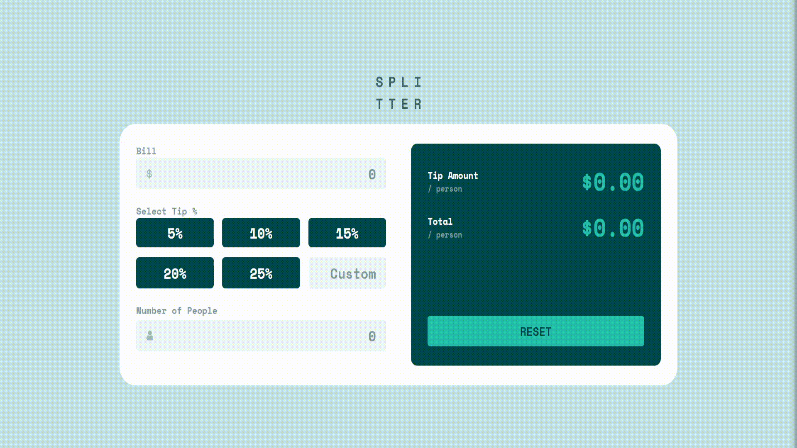

# Tip calculator app solution

This is a solution to the [Tip calculator app challenge](https://www.frontendmentor.io/challenges/tip-calculator-app-ugJNGbJUX) on Frontend Mentor.

## Solution

### The challenge
Users should be able to:

- View the optimal layout for the app depending on their device's screen size
- See hover states for all interactive elements on the page
- Calculate the correct tip and total cost of the bill per person

### Design Templates
**Desktop View**

**Mobile View**

### Links

- Solution URL: [GitHub](https://github.com/irishmicoletcando/tip-calculator)
- Live Site URL: [Tip Calculator](https://tip-calculator-jet-two.vercel.app/)

### Built with

- Semantic HTML5 markup
- CSS custom properties
- Flexbox
- CSS Grid
- Mobile-first workflow
- Vanilla JavaScript

### Author

- Frontend Mentor - [@irishmicoletcando](https://www.frontendmentor.io/profile/irishmicoletcando)